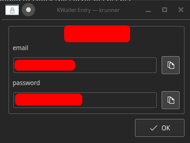

# KWallet-Runner

A simple KWallet Runner for KDE Plasma that supports searching/viewing entries and adding new entries.

**NOTE: Only searches your default wallet**

## Search:

```
kwallet ${searchTerm}
# Example
kwallet email.com
```




## New Entry

```
kwallet-add ${serviceName} key=value
# Example
kwallet-add "email.com" email="you@email.com" password="abc123"
```

## Compiling/Building

### Requirements (Ubuntu 20.04):

`sudo apt install qtdeclarative5-dev libkf5wallet-dev libkf5runner-dev libkf5service-dev libkf5i18n-dev libkf5notifications-dev gettext`

### Building

```sh
git clone https://github.com/jimtendo/onetimepass-plasma
cd onetimepass-plasma
mkdir build
cmake -D KDE_INSTALL_USE_QT_SYS_PATHS=ON -DCMAKE_BUILD_TYPE=Debug ../
make
sudo make install
```
